# 🧳 Travel Chatbot — Project README

## 📘 Overview

The Travel Chatbot is an intelligent agent-based system designed to help individuals and groups plan trips efficiently. It assists in finding suitable housing, recommending places to visit, and optimizing the overall trip plan to fit within the defined budget and preferred standard.

---

## 🚀 Features

* Accommodation recommendations based on location, budget, and desired standard.
* Activity and experience planning tailored to user preferences.
* Budget optimization to maximize value and stay within budget constraints.
* Supports individual and group trip planning.

---

## 🪄 Agent Architecture

### 1️⃣ Accommodation Agent

* Finds appropriate housing based on inputs (location, budget, group size, and standard).
* Provides ranked results with price, ratings, and booking info.

### 2️⃣ Experience Planner Agent

* Suggests an itinerary of attractions, dining, and entertainment aligned with user interests and trip duration.
* Includes estimated costs for activities.

### 3️⃣ Budget Optimizer Agent

* Takes accommodation and experience suggestions and adjusts to fit within the total budget.
* Highlights trade-offs between quality and cost.
* Outputs a final recommended itinerary with a cost breakdown.

---

## 🪜 Workflow

1. User provides: location, dates, group size, preferences, budget, and standard.
2. Accommodation Agent generates housing options.
3. Experience Planner Agent generates a list of activities.
4. Budget Optimizer Agent combines results and ensures the plan stays within budget.
5. Chatbot outputs an optimized trip plan.

---

## 📄 Output

* Final itinerary: housing + activities + estimated total cost.
* Optionally: booking links and contact information.

---

## 🧰 Future Enhancements

* Group coordination tools (polls, consensus building).
* Transportation suggestions.
* Integration with booking APIs for instant reservations.
* Dynamic re-planning based on real-time changes.

---

## 📝 Setup & Usage

(Describe here how to run or deploy the chatbot when implemented — e.g., installation, configuration, and execution steps. This section can be updated once implementation begins.)

---

## 🤝 Contributing

Contributions to improve features, fix bugs, or extend functionality are welcome. Please create a pull request or open an issue to discuss changes.

---

## 📜 License

Specify the license here (e.g., MIT, Apache 2.0, etc.).

---

For any questions or support, please contact the project maintainer or open an issue in the repository.


# TrailMate Workflow Design

## Agent Orchestration Flow Diagram

This diagram illustrates the complete workflow of TrailMate's three specialized agents (Accommodation, Experience Planner, and Budget Optimizer) and how they interact with user input and each other to create an optimal travel plan.

### Key Components:
- 👤 User Input & Validation Flow
- 🏠 Accommodation Agent Process
- 🎯 Experience Planner Agent Process
- 💰 Budget Optimizer Agent Process
- 📱 User Interaction & Feedback Loop

```mermaid
graph TD
    A[👤 User Input] --> B{Input Validation}
    B -->|Missing Info| C[🔄 Request Missing Details]
    C --> A
    B -->|Complete| D[📋 Process User Requirements]
    
    D --> E[🏠 Accommodation Agent]
    D --> F[🎯 Experience Planner Agent]
    
    E --> G[🔍 Search Housing Options]
    G --> H[📊 Rank by Price & Rating]
    H --> I[📝 Generate Accommodation List]
    
    F --> J[🗺️ Research Destination]
    J --> K[🎨 Match User Preferences]
    K --> L[⏰ Plan Activities by Duration]
    L --> M[📝 Generate Activity List]
    
    I --> N[💰 Budget Optimizer Agent]
    M --> N
    
    N --> O[🧮 Calculate Total Costs]
    O --> P{Within Budget?}
    
    P -->|No| Q[⚖️ Optimize & Adjust]
    Q --> R[🔄 Reduce Costs]
    R --> S[📋 Alternative Options]
    S --> P
    
    P -->|Yes| T[✅ Final Itinerary]
    T --> U[📊 Cost Breakdown]
    U --> V[🔗 Booking Links]
    V --> W[📱 Present to User]
    
    W --> X{User Satisfied?}
    X -->|No| Y[📝 Modification Request]
    Y --> Z[🔄 Iterate Process]
    Z --> N
    
    X -->|Yes| AA[✈️ Trip Plan Finalized]
    AA --> BB[📧 Send Confirmation]
    BB --> CC[🎉 End]
    
    style A fill:#e1f5fe
    style CC fill:#c8e6c9
    style N fill:#fff3e0
    style E fill:#f3e5f5
    style F fill:#e8f5e8
    style W fill:#fff9c4
    
    classDef userAction fill:#e1f5fe,stroke:#0277bd,stroke-width:2px
    classDef agentAction fill:#f3e5f5,stroke:#7b1fa2,stroke-width:2px
    classDef decision fill:#fff3e0,stroke:#f57c00,stroke-width:2px
    classDef output fill:#c8e6c9,stroke:#388e3c,stroke-width:2px
    
    class A,C,Y userAction
    class E,F,N agentAction
    class B,P,X decision
    class W,AA,BB,CC output
```



## Workflow Description

1. **User Input & Validation**
   - Initial user input is validated
   - Missing information is requested
   - Complete requirements are processed

2. **Parallel Agent Processing**
   - Accommodation Agent searches and ranks housing options
   - Experience Planner Agent researches and plans activities

3. **Budget Optimization**
   - Budget Optimizer Agent receives both accommodation and activity plans
   - Calculates total costs and ensures budget compliance
   - Provides alternatives if needed

4. **User Interaction**
   - Final itinerary is presented to user
   - Feedback loop allows for modifications
   - Confirmation sent upon approval

## Color Legend

- 🔵 Blue (User Actions): User input and interaction points
- 🟣 Purple (Agent Actions): Primary agent processing steps
- 🟠 Orange (Decisions): Key decision points in the workflow
- 🟢 Green (Outputs): Final outputs and confirmations

## Notes

- The workflow is designed to be iterative and user-centric
- All three agents work in coordination for optimal results
- Budget optimization is a continuous process
- User satisfaction is prioritized with feedback loops


## 🚀 How to Run TrailMate

Follow these steps to set up and run the TrailMate Smart Travel Planning Chatbot locally:

### 1. Clone the Repository

### 2. Set Up Environment Variables

- Copy `.sample.env` to `.env`:
  ```bash
  cp .sample.env .env
  ```
- Fill in all required API keys and configuration values in `.env` (see the "Environment Variables Required" section above).

### 3. Install Dependencies

- It is recommended to use a virtual environment:
  ```bash
  python3 -m venv .venv
  source .venv/bin/activate
  ```
- Install Python dependencies:
  ```bash
  pip install -r requirements.txt
  ```
Run the agent 
  ``` 
   python supervisor_agent.py

   ```
# Trailmate-backend-
